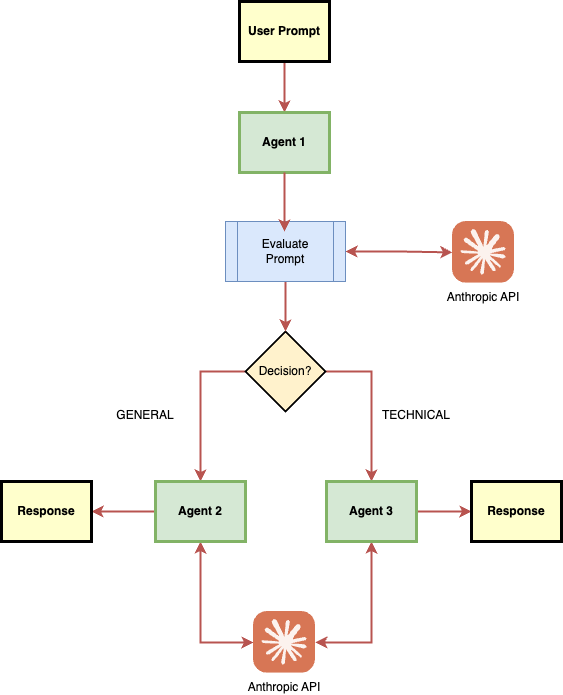

# Multi-agent starter

A sophisticated multi-agent starter that intelligently routes and answers questions using Claude 3 Sonnet. The system automatically determines whether a question is technical or general and routes it to the appropriate specialized agent. This solution could be easily extended to support more agents. Another improvement would be to add tools to existing agents. 

## Overview


## Features

- Intelligent question type detection
- Specialized agents for technical and general questions
- Robust error handling with exponential backoff
- Structured response format
- Interactive command-line interface
- JSON output support

## Prerequisites

- Python 3.8+
- Anthropic API key
- Required Python packages (see `requirements.txt`)

## Installation

1. Clone the repository:
```bash
git clone <repository-url>
cd multi-agent
```
2. Create Python Virtual Environment
```bash
python3 -m venv .venv
source .venv/bin/activate
```

3. Install dependencies:
```bash
pip3 install -r requirements.txt
```

4. Copy `.env-example` file in the project root:
```bash
cp .env-example .env
```
5. Add your Anthropic API key to copied .env file:
```
ANTHROPIC_API_KEY=your_api_key_here
```

## Usage

Run the main script:
```bash
python main.py
```
The system will prompt you to enter questions. Type 'q' to quit.

### Example Questions

Technical:
- "How do I implement a binary search tree in Python?"
- "What's the best way to handle API rate limiting?"

General:
- "What are the benefits of meditation?"
- "How does photosynthesis work?"

## Project Structure

```
multi-agent/
├── agents.py          # Agent implementations and LLM setup
├── graph.py          # Workflow graph definition
├── main.py           # Main application entry point
├── requirements.txt  # Project dependencies
└── .env             # Environment variables (create this)
```

## Response Format

The system provides structured responses in the following format:
```json
{
    "content": {
        "main_answer": "Brief overview or direct answer",
        "supporting_details": [
            "Detail 1",
            "Detail 2",
            ...
        ]
    },
    "metadata": {
        "response_id": "...",
        "model": "claude-3-sonnet-20240229",
        "run_id": "...",
        "stop_reason": "...",
        "token_usage": {...}
    }
}
```
Output format allows easier response processing and forwarding than default.

## Error Handling

The system includes robust error handling for:
- API overload (with exponential backoff)
- Authentication errors
- General exceptions

## Contributors

Erno Vuori (erno.vuori@almamedia.fi)

## Contributing

1. Fork the repository
2. Create a feature branch
3. Commit your changes
4. Push to the branch
5. Create a Pull Request

## License

[Add your license information here]

## Acknowledgments

- Built with LangGraph and LangChain
- Powered by Claude 3 Sonnet 